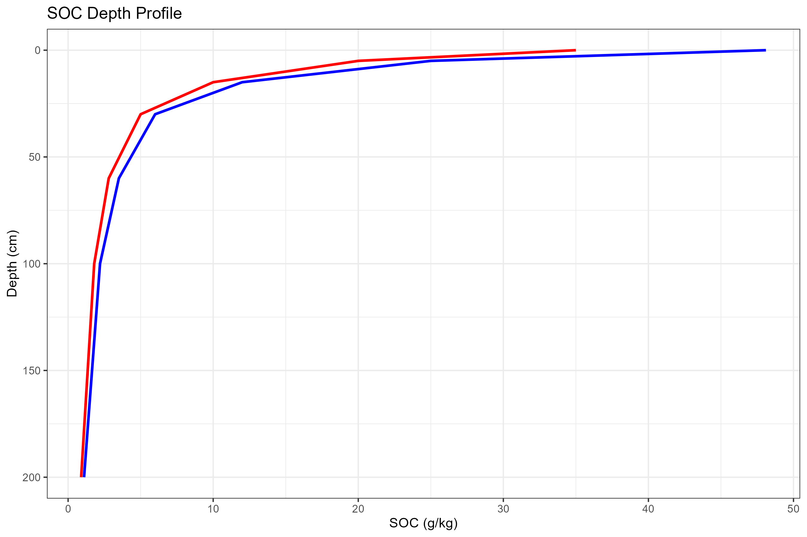
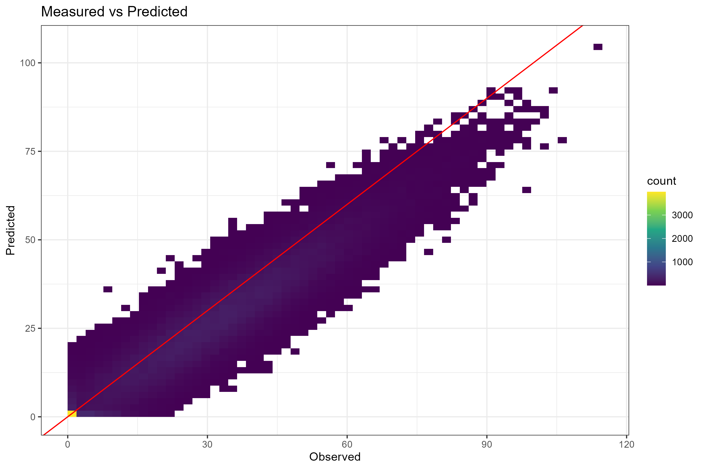
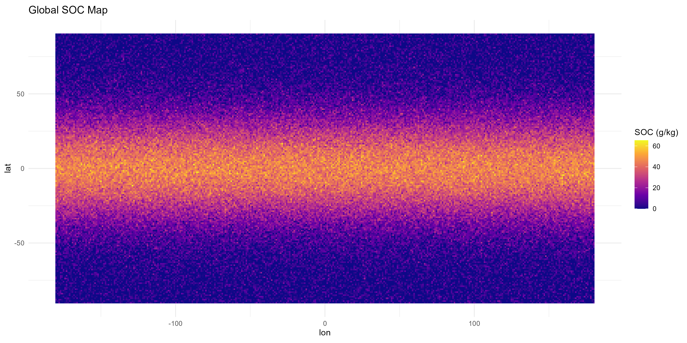
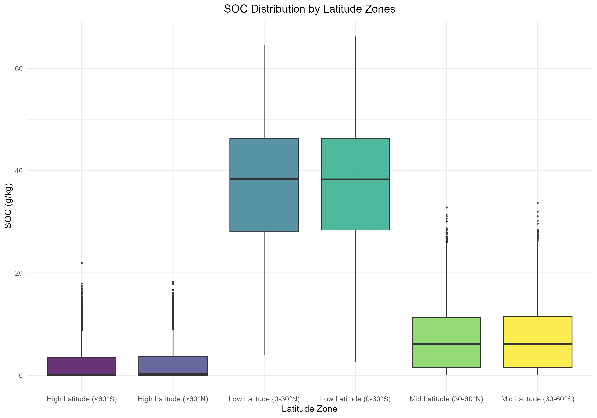

# 1. 研究背景与数据源
本项目复现 Hengl et al. (2017) SoilGrids250m 全球土壤数据集，原始数据来自 ISRIC‑WorldSoil 全球土壤调查数据库。
采用 Quarto 文学化编程 + renv 环境锁定，实现全流程可复现分析。

# 2. 数据预处理流程
1. 构建全球经纬度栅格，划分6个纬度梯度带；
2. 构建0‑200cm土壤深度剖面数据集；
3. 构建实测‑预测配对数据集；
4. 固定随机种子 set.seed(999)，剔除SOC负值；
5. renv锁定依赖包版本，消除环境差异。

# 3. 数据分析、可视化及结果解读
## 3.1 土壤有机碳深度剖面

**解读**：SOC主要集中在0‑30cm表层，随土层加深快速降低。

## 3.2 实测值 vs 模型预测值

**解读**：模型整体预测精度较高，R²=69.2%。

## 3.3 全球表层土壤有机碳空间分布

**解读**：SOC呈现纬度梯度，赤道热带含量最高，向两极递减。

## 3.4 不同纬度带SOC分布差异

**解读**：低纬度SOC显著高于中高纬度，南北半球基本对称。

# 4. 模型精度结果
精度指标：data/SoilGrids_accuracy_table.csv
核心：SOC预测R²=69.2%，RMSE=3.81 g/kg。

# 5. 可重复性保障
1. 随机种子固定，结果唯一；
2. renv锁定包版本，环境统一；
3. 全部使用相对路径；
4. quarto render 一键生成报告；
